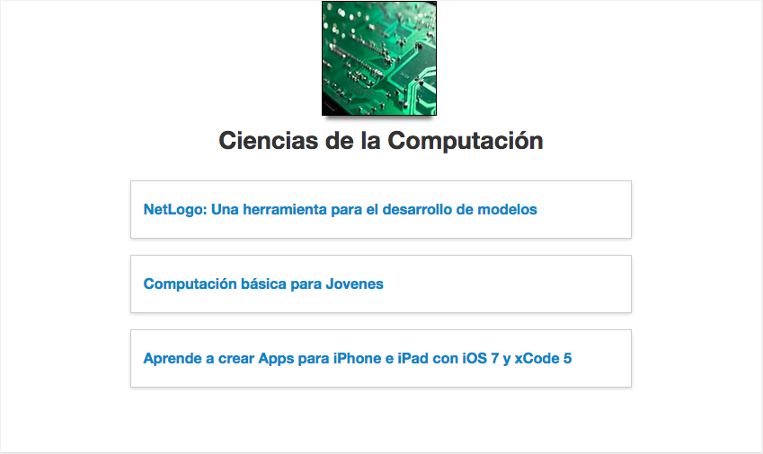
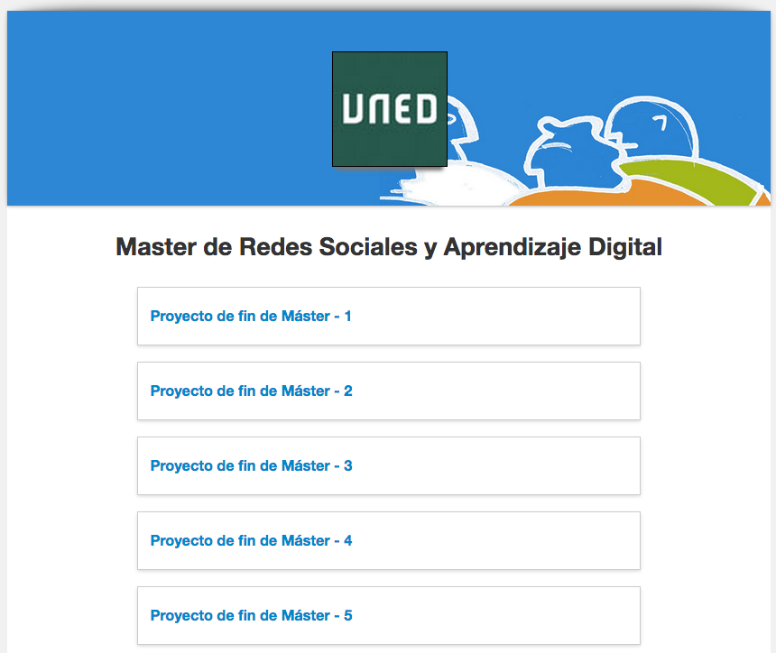

.. _Categories:

##########
Categories
##########

*******************
Overview
*******************

The categories are like a tags and a course can be in multiple categories

``https://demo.openmooc.org/category/cat1/``

You can add more categories in the URL to filter a group of them like

``https://demo.openmooc.org/category/cat1/cat2/cat3``

Categories and the URL scheme used by OpenMOOC are very useful to be used to
promote the course and is optimal for search engine.

OpenMOOC not have categories by default, you must create them as an administrator to assign it to a course.

*****************************
Adding categories to a course
*****************************

#. You can add categories to the course. Some categories only can be added by the platform administrator.

   .. image:: _static/5_categories-1.png
    :alt: Adding categories to the course

*********************
Organization web page
*********************

Some categories are used to group classes of an organization.
These categories can only be assigned to a course by the platform administrators.

``https://demo.openmooc.org/category/organization1/``

In this way, you get the organization page on the platform, with the list of courses.
The thumbnail image, the short description and start date will be shown for each course listed.
