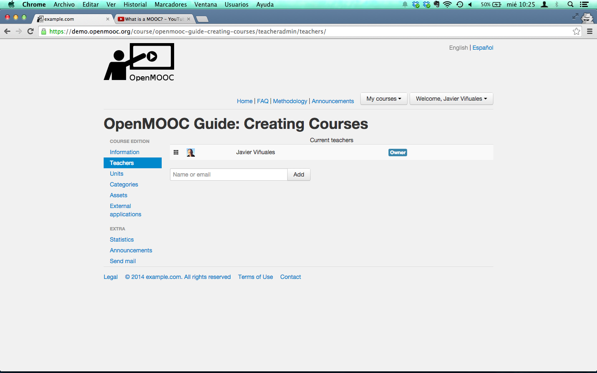

.. _Course teachers:

###############
Course teachers
###############

*******************
Overview
*******************

The user who creates the course is by default the owner but, he can
transfer the ownership to another course teacher.

The owner user can add additional teachers to the course, forming the
teaching staff of the course.

To add a teacher, can be searched by name or by email and if not yet a user of the platform,
you will be sent an invitation to register. The teacher who is invited to join the team of a
course always receive an email about it.

*********************************
Steps to add teachers to a course
*********************************

#. Select the user to add like a new teacher of the course.

   .. image:: _static/3_course_teachers-2.png
    :alt: Selecting new teacher

#. The user you added is listed and you get a message from the platform like ``Success: The teacher has been added to the course or invited``.

   .. image:: _static/3_course_teachers-3.png
    :alt: Entering the course name

#. If you want to transfer the ownership you can do it new because there are more than one teacher in the course staff.

   .. image:: _static/3_course_teachers-4.png
    :alt: Entering the course name
